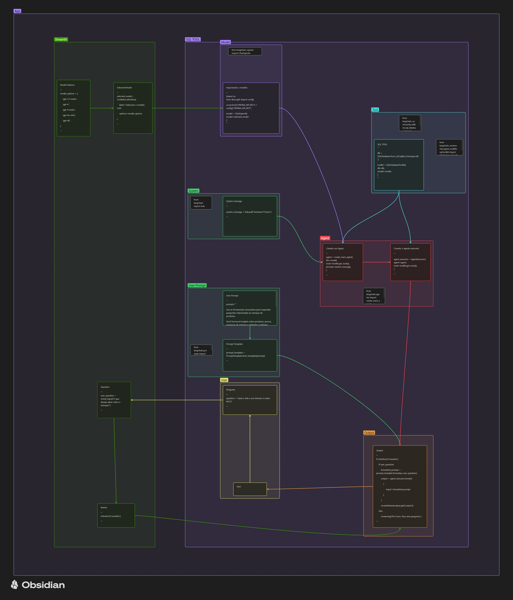

# Streamlit e IA - modelo de consulta de estoque

 ---
 Tags:  #literature
 Description: [[Mestrado ITA 👨🏽‍🏫]],  [[Machine Learning]], [[Integrando com API GPT(OpenAI)]]
 Theme:
## ID: 20250303221133
---

# Descrição breve: 

## Streamlit

O **Streamlit** é uma biblioteca em Python focada em criação rápida de aplicações web interativas, especialmente voltadas para a área de ciência de dados e aprendizado de máquina. Com ele, é possível transformar scripts Python em protótipos de maneira simples, sem precisar lidar diretamente com detalhes de front-end (HTML, CSS, JavaScript), pois a biblioteca cuida dessa parte automaticamente.

**Instalação e uso simples**: após instalar com `pip install streamlit`, você cria um arquivo Python e, nele, usa funções como `st.title()`, `st.write()`, `st.text_input()`, etc. Para rodar, basta executar `streamlit run nome_do_arquivo.py`.

- **Interatividade instantânea**: qualquer modificação no código gera, quase de imediato, uma atualização na interface do usuário. É muito usado para criar protótipos ou demonstrar experimentos de maneira rápida.

- **Componentes personalizáveis**: além dos elementos básicos (botões, sliders, caixas de texto), é possível criar componentes personalizados ou integrar bibliotecas de visualização, como Plotly, Matplotlib ou Altair, facilitando a parte de geração de gráficos e dashboards.

### Aplicações com LLMs

A combinação de Streamlit com modelos de linguagem (LLMs) permite criar:

1. **Protótipos de chatbots**: usando uma API de modelo de linguagem (ou um modelo local) para ter uma interface conversacional. Você pode exibir o histórico de conversa, entrada do usuário e respostas em tempo real.
2. **Ferramentas de análise de texto**: por exemplo, analisar sentimentos, gerar resumos, traduzir textos ou fazer completions de código e exibir resultados de forma interativa.
3. **Sistemas de Perguntas e Respostas**: abastecidos por grandes modelos de linguagem, é possível criar uma interface onde o usuário faz perguntas sobre um conjunto específico de dados (documentos, PDFs, bases de conhecimento) e vê as respostas de forma imediata.
4. **Visualização de embeddings**: ao integrar um modelo que gera embeddings (vetores de representação de texto), pode-se criar interfaces para projeções em 2D/3D e interatividade com esses pontos, auxiliando em análises de similaridade ou clustering de textos.
5. **Demonstrações de aplicações de IA generativa**: por exemplo, demonstrar como um modelo gera texto criativo, cria scripts, responde a perguntas técnicas etc., tudo em uma página interativa que qualquer um pode acessar para testar.

 **Streamlit** facilita a criação de aplicações web que utilizam LLMs, pois provê uma estrutura leve e intuitiva para construir interfaces de usuário. Isso viabiliza demonstrar projetos de IA de maneira rápida, sem gastar muito tempo com front-end e infraestrutura.

---
# Contexto

- **Situação**: Primeiro semestre no ita e fazendo o curso do Pycode BR.
- **Fonte**: 

## Próximos Passos
- **Ação 1**: 
- **Ação 2**: 

## Referências

- [LangChain](https://www.langchain.com/) - Site Oficial
- [OpenAi API](https://platform.openai.com/api-keys) - site da OpenAI para devs
- [LangChang Docs](https://python.langchain.com/v0.2/docs/introduction/)
- [LangChain Community](https://pypi.org/project/langchain-community/)
- [LangChain Expression Language](https://python.langchain.com/v0.2/docs/how_to/#langchain-expression-language-lcel)
- [How to Chain runnables](https://python.langchain.com/v0.2/docs/how_to/sequence/)
- [LangChain Tools](https://python.langchain.com/v0.2/docs/integrations/tools/)
- [Tools](https://composio.dev/tools)
- [LangChain Hub](https://smith.langchain.com/hub/)
- [SQLDatabase Toolkit](https://python.langchain.com/v0.2/docs/integrations/tools/sql_database/)

=== gpt ===

-  [Gpt key](https://platform.openai.com/playground/chat?models=gpt-4o) - plataforma para desenvolvedores
- [Api Pricing](https://openai.com/api/pricing/)
- [Api key](https://platform.openai.com/api-keys)
- [models](https://platform.openai.com/docs/models)
- [GPT Embedding]([Vector embeddings - OpenAI API](https://platform.openai.com/docs/guides/embeddings))

=== Vector ===

- [**Pinecone**](https://www.pinecone.io/)
- [**Chroma**](https://www.trychroma.com/)

=== Streamlit ===

- [Streamlit Docs](https://docs.streamlit.io/get-started)

